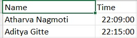

# Multimodal Face Detection-Recognition Attendance Management System

An Attendance Management System consisting of a Face Detection and Recognition model implemented utilising the concept of Multimodal Execution through Intel's OpenVino Runtime environment.

## Requirements

- OpenVino Runtime Environment
- .xml and .bin files of the models(obtained from omz_downloader, omz_converter or from native repository)

## Modules Referenced/Used

The Openvino samples of Object Detection and Face Recognition were referenced during building this sample
https://docs.openvino.ai/latest/omz_demos_object_detection_demo_python.html
https://docs.openvino.ai/latest/omz_demos_face_recognition_demo_python.html
https://docs.openvino.ai/latest/omz_models_model_face_detection_retail_0004.html
https://docs.openvino.ai/latest/omz_demos_face_recognition_demo_python.html

## Models Used

The following models were used in the execution of the respective parts

### 1.Face Detection: face-detection-retail-0004

Face detector based on SqueezeNet light (half-channels) as a backbone with a single SSD for indoor/outdoor scenes shot by a front-facing camera. The single SSD head from 1/16 scale feature map has nine clustered prior boxes.

On startup, the application reads command-line parameters and loads a model to OpenVINO Runtime plugin. Upon getting a image or video frame from the OpenCV VideoCapture, it performs inference and displays the results of the faces detected with their respective bounding boxes.

The Module Consists of 3 main parts and a main function:

-> An arguement parser function which parses the command line arguements for them to be sent as input to our model.

-> The draw detections function which draws the detection bounding boxes after face detection by our model.This also writes the data of the detected faces and the coordinates of the bounding boxes(xmin,ymin,xmax,ymax) in a .json file, which is passed onto our face recognition model as the input for the faces detected in-frame.The recognition model performs it's inference over this.

-> The print raw results function which prints the input image with their detected faces and corresponding bounding boxes.

### Model Parameters:

1.Input: input_shape[1,3,300,300]~[B,C,H,W]

Image, name: data, shape: 1, 3, 300, 300 in the format B, C, H, W, where:

-> B - batch size

-> C - number of channels

-> H - image height

-> W - image width

Expected color order: BGR.

2.Output:output blob shape:[1,1,N,7]

The net outputs blob with shape: 1, 1, 200, 7 in the format 1, 1, N, 7, where N is the number of detected bounding boxes. Each detection has the format [image_id, label, conf, x_min, y_min, x_max, y_max], where:

-> image_id - ID of the image in the batch

-> label - predicted class ID (1 - face)

-> conf - confidence for the predicted class

-> (x_min, y_min) - coordinates of the top left bounding box corner

-> (x_max, y_max) - coordinates of the bottom right bounding box corner

### 2.Face Recognition

In particular, this mscript uses 3 models to build a pipeline able to detect faces on videos, their keypoints (aka “landmarks”), and recognize persons using the provided faces database (the gallery). The following pretrained models were used:

-> face-detection-retail-0004 and face-detection-adas-0001, to detect faces and predict their bounding boxes;

-> landmarks-regression-retail-0009, to predict face keypoints;

-> face-reidentification-retail-0095, Sphereface, facenet-20180408-102900 or face-recognition-resnet100-arcface-onnx to recognize persons.

The application is invoked from command line. It reads the specified input video stream frame-by-frame, be it a camera device or a video file, and performs independent analysis of each frame. In order to make predictions the application deploys 3 models on the specified devices using OpenVINO library and runs them in asynchronous manner. An input frame is processed by the face detection model to predict face bounding boxes. Then, face keypoints are predicted by the corresponding model. The final step in frame processing is done by the face recognition model, which uses keypoints found to align the faces and the face gallery to match faces found on a video frame with the ones in the gallery. Then, the processing results are visualized and displayed on the screen and written to the output CSV file.

To recognize faces the application uses a face database, or a gallery. The gallery is a folder with images of persons. Each image in the gallery can be of arbitrary size and should contain one or more frontally-oriented faces with decent quality. There are allowed multiple images of the same person, but the naming format in that case should be specific - {id}-{num_of_instance}.jpg. For example, there could be images Paul-0.jpg, Paul-1.jpg etc. and they all will be treated as images of the same person. In case when there is one image per person, you can use format {id}.jpg (e.g. Paul.jpg). The application can use face detector during the gallery building, that is controlled by --run_detector flag. This allows gallery images to contain more than one face image and not to be tightly cropped. In that mode the user will be asked if he wants to add a specific image to the images gallery (and it leads to automatic dumping images to the same folder on disk). If it is, then the user should specify the name for the image in the open window and press Enter. If it’s not, then press Escape. The user may add multiple images of the same person by setting the same name in the open window.
Image file name is used as a person name during the visualization.

### Model Parameters:

#### The Parameters for the compatible models:-

1.face-reidentification-retail-0095

a) Input:
-> [B,C,H,W]~[1,3,128,128]
-> BGR

b) Output:
-> Shape [1,256,1,1]

2.face-detection-adas-0001

a) Input:
-> [B,C,H,W]~[1,3,348,672]->BGR

b) Output:
-> Shape=[1,1,200,7]~[1,1,N,7];
N=Number of detected boxes

-> Detection Format=[image_id, label, conf, x_min, y_min, x_max, y_max]

3.landmarks-regression-retail-0009

a) Input:
->[B,C,H,W]~[1,3,48,48]
->BGR

b) Output:
->Shape=[1,10,1,1]

4.face-detection-retail-0004

## External Resources

-> A Csv file in the same directory as the sample; this file contains the data of attendance,with the detected face's name and time of recognition.

## Results and Conclusion
